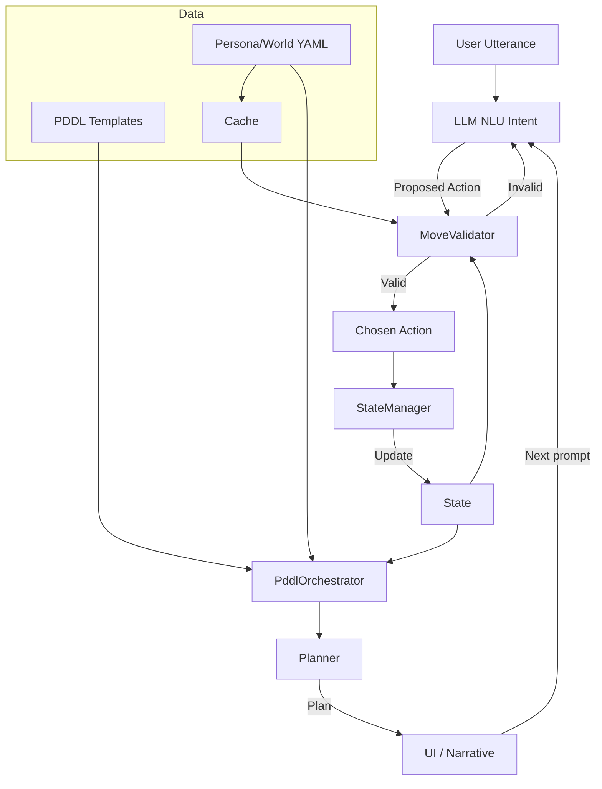

## Core Logic Flow (NeuroSymbolic Dialogue)

Mermaid diagram of the main control loop (LLM constrained by symbolic guards; planner grounded in PDDL):

### Components
- **MoveValidator** (`npc_engine/engine/gamemaster/move_validator.py`): Computes allowed actions from cache (contexts, triggers, personas) + current state (context, concepts, unlocked, mood). Anything outside this set is rejected.
- **StateManager** (`npc_engine/engine/gamemaster/state_manager.py`): Executes only validated actions; updates concepts, visited/unlocked, mood, inventory tags/items; now includes combo unlock handler.
- **PddlOrchestrator** (`npc_engine/engine/master/pddl_orchestrator.py`): Renders PDDL domain/problem from templates + YAML + current state; injects dynamic items/concepts.
- **Planner** (`npc_engine/engine/master/planner.py`): Runs unified_planning/Fast Downward on generated PDDL; returns plan steps or diagnostics.
- **UI/Narrative**: Presents plan / next moves; prompts LLM with fresh state each turn.

### Why this constrains hallucinations
- Allowed actions are derived from formal data (YAML + current state); LLM proposals outside the set are dropped.
- State mutations occur only through deterministic handlers.
- PDDL is regenerated each turn from state/YAML; planner cannot see or act on hallucinated symbols.
- Prompts are rebuilt from state, not LLM history.
